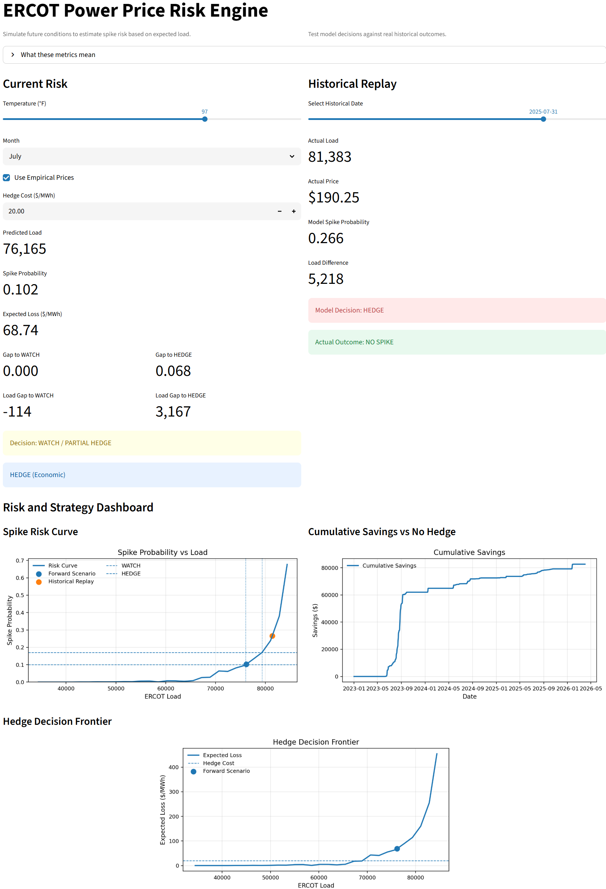

  # 🔌 ERCOT Power Price Risk Engine

A decision engine that translates weather-driven load forecasts into **power price spike risk and hedging actions**, with full historical backtesting and economic impact.

---

## Overview

Electricity markets exhibit extreme price spikes driven by demand (load) under constrained supply conditions. This project models that relationship and answers a practical question:

> **When should you hedge power price risk based on expected conditions?**

This application:
- Forecasts ERCOT load from temperature and seasonality  
- Estimates spike probability based on historical load regimes  
- Generates trading signals (**NO HEDGE / WATCH / HEDGE**)  
- Evaluates decisions against real historical outcomes  
- Quantifies economic impact of hedging vs not hedging  

---

## 🚀 Live App



---

## ⚙️ How It Works

### 1. Load Forecast

Linear regression using:
- Temperature (°F)  
- Temperature² (nonlinearity)  
- Month (seasonality)  


Load = f(Temperature, Temperature², Month)


---

### 2. Spike Risk Model

- Historical ERCOT data is bucketed by load levels  
- For each load range:

**Spike Probability = P(price > $200 | load level)**

- Produces a **risk curve: load → spike probability**

---

### 3. Signal Generation

| Condition | Signal |
|----------|--------|
| Low risk | NO HEDGE |
| Moderate risk | WATCH / PARTIAL HEDGE |
| High risk | HEDGE |

**Thresholds:**
- WATCH: 10%  
- HEDGE: 17%  

---

### 4. Economic Decision Engine

Core formula:


Expected Spike Cost = P(spike) × (Spike Price − Normal Price)


Decision rule:


If Expected Spike Cost > Hedge Cost → HEDGE
Else → NO HEDGE


This converts probability into a **financial decision**.

---

## 📊 Key Features

### 🔹 Forward Simulation
- Input temperature + month  
- Outputs:
  - Predicted load  
  - Spike probability  
  - Signal  
  - Optimal economic decision  

---

### 🔹 Historical Replay
- Select real historical dates  
- Compare:
  - Model signal vs actual outcome  
  - Predicted vs actual load  
  - Spike vs no spike  

---

### 🔹 Risk Curve Visualization
- Load vs spike probability  
- Shows:
  - Forward scenario  
  - Historical scenario  
  - Decision thresholds  

---

### 🔹 Hedge Decision Frontier
- Expected spike cost vs hedge cost  
- Identifies where hedging becomes optimal  

---

### 🔹 Backtest Performance

| Metric | Value |
|-------|------|
| Total Days | 1,187 |
| Actual Spike Days | 110 |
| Precision | 30.46% |
| Recall | 54.55% |
| Accuracy | 84.25% |

**Interpretation:**
- Spikes are rare events  
- Model prioritizes **recall over precision**  
- Designed to reduce exposure to **high-cost tail risk**

---

### 💰 Economic Impact

- **Total Savings vs No Hedge:** $82,663  
- Daily strategy simulation  
- Full cumulative P&L tracking  

---

## 📈 Example Insight

At high load levels:
- Spike probability increases nonlinearly  
- Expected spike cost rapidly exceeds hedge cost  
- Optimal decision shifts to **HEDGE**

This behavior is captured in the **Hedge Decision Frontier**.

---

## 🗂️ Data Sources

- ERCOT load data  
- ERCOT hub pricing  
- NOAA weather data  

---

## 🛠️ Tech Stack

- Python  
- pandas / numpy  
- scikit-learn  
- matplotlib  
- Streamlit  

---

## 📁 Project Structure

```text
ercot-power-risk-engine/
│
├── data/
│ └── processed/
│ ├── weather_load_merged.csv
│ └── price_load_merged.csv
│
├── src/
│ └── app.py
│
├── requirements.txt
└── README.md
```

## ▶️ How to Run

```bash
pip install -r requirements.txt
streamlit run src/app.py
```
--- 

## 🎯 Why This Project Matters

Most data projects stop at prediction.

This system goes further:

Prediction → Probability
Probability → Decision
Decision → Economic Outcome

This reflects how real trading and risk systems operate.

## 🔮 Future Improvements
- Incorporate outages, renewables, fuel inputs
- Dynamic threshold optimization
- Intraday modeling
- Probabilistic price distributions

### 👤 Author
Chris Ruiz  